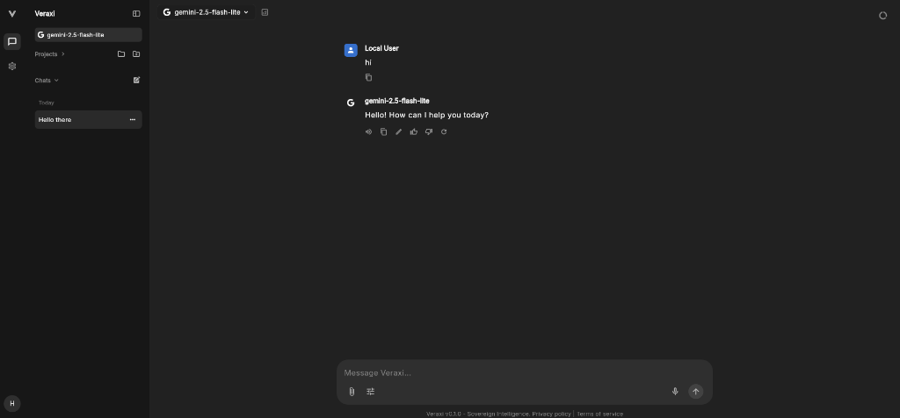

# Veraxi

A sovereign intelligence platform that combines a knowledge graph (Neo4j) and vector search (Qdrant) to give an LLM autonomous, tool-based access to both relational and semantic context. Supports Cloud APIs (OpenAI, Anthropic, Google, Groq, DeepSeek, Kimi) and Local AI models (Ollama, LM Studio).

Veraxi utilizes Reciprocal Rank Fusion (RRF) to merge structured graph lookups and semantic vector similarities into a single, high-fidelity context window, allowing the LLM to deduce deep architectural and organizational realities with significantly reduced hallucination risk.

## 🌐 Live Demo
Veraxi is currently deployed and live!
- **Frontend (Flutter Web):** [https://veraxi.me](https://veraxi.me) (Hosted on GitHub Pages)
- **Backend API (FastAPI):** `https://veraxi-backend-877632476404.us-east4.run.app` (Hosted on Google Cloud Run)



## Why Hybrid GraphRAG?

Standard vector-based RAG excels at simple, local lookups but hallucinates heavily when asked "global" or multi-hop questions (e.g., connecting disparate entities across a large corpus). Veraxi solves this by explicitly mapping relationships as hard mathematical edges in a graph, while still preserving vector search for fuzzy concepts. 

According to recent enterprise benchmarks, moving from standard vector RAG to a Hybrid GraphRAG architecture yields:
- **~62% average reduction in hallucinations** across production deployments.
- **Nearly 30% absolute accuracy improvements** on complex queries (e.g., jumping from 50% to 80% accuracy in industry benchmarks).
- **Global Sensemaking:** The ability to run Graph Data Science community detection to summarize macroscopic themes across thousands of documents without relying solely on limited LLM context windows.

## Status

**v1.0.0 (MVP Live)**
The Veraxi platform MVP has been successfully completed and deployed to production. 

Features successfully implemented so far include:
- A multi-tenant FastAPI engine featuring Stripe webhook integration and secure JWT authentication.
- Tenant-Specific Dynamic Ontologies: A strict, user-defined graph schema enforced during ingestion, with LLM auto-generation for effortless setup.
- Docling-powered multimodal ingestion and an SSE-based Model Context Protocol (MCP) transport layer with dynamic rate limiting.
- A premium, modern, cross-platform Flutter client featuring zero-config UI support for both Cloud APIs (OpenAI, Anthropic, Google, Groq, DeepSeek, Kimi) and Local AI providers (e.g. Ollama, LM Studio).
- Corrective Retrieval Augmented Generation (CRAG) with web search fallback and LLM-as-a-judge grounding evaluation.
- **Enterprise Isolation Mode:** Built-in SSRF protection and UI lockdown for corporate environments (via the `IS_ENTERPRISE` flag) where administrators dictate endpoints and end-users cannot alter model routing.

See [docs/ROADMAP.md](docs/ROADMAP.md) for the historical evolution of the project.

## Architecture

See [docs/architecture.md](docs/architecture.md) for a deep dive into the dependency flow and design rules.

- **Storage:** Neo4j (Graph), Qdrant (Vectors), SQLite (UI Persistence)
- **Intelligence:** OpenAI-compatible SDK (Multiple Cloud Providers & Local LLMs)
- **Backend Intelligence Engine:** FastAPI
- **Frontend:** Flutter (Dart), Riverpod, flutter_secure_storage (libsecret)
- **CI/CD:** Ephemeral Docker Environments (GCP Staging)

## Can I run this for free?

**Yes!**
- The databases (Neo4j and Qdrant) run entirely locally for free via Docker.
- The intelligence engine connects dynamically to any OpenAI-compatible API, meaning you can run models entirely locally (via Ollama or LM Studio) for 100% free, private inference.
- If you prefer cloud APIs, you can use the **Google Gemini API** or **Groq API**, which currently offer **very generous Free Tiers**.

Anyone can clone this repo and run their own autonomous intelligence system on their local machine at absolutely no cost.

## 🛠 Quickstart Setup (Local Development)

1. **Clone and enter the repository:**
   ```bash
   git clone https://github.com/kcoaguila-dev/veraxi.git
   cd veraxi
   ```

2. **Start the databases & infrastructure:**
   ```bash
   docker compose up -d neo4j qdrant redis searxng
   ```
   *(This spins up local, ephemeral instances of Neo4j, Qdrant, Redis, and SearxNG without the backend, allowing you to run the Python server locally).*

3. **Configure the environment:**
   Copy the example config and add your preferred API keys.
   ```bash
   cp backend/.env.example backend/.env
   # Edit backend/.env and add your LLM_API_KEY (e.g., OpenAI, Gemini, Groq, or Local)
   ```

4. **Install Python dependencies:**
   ```bash
   python3 -m venv backend/.venv
   source backend/.venv/bin/activate
   cd backend
   pip install -e ".[dev]"
   cd ..
   ```

## 🎙️ GPT-SoVITS Voice Integration (Self-Hosted)

Veraxi fully supports external, self-hosted **GPT-SoVITS** inference nodes to provide natural Text-to-Speech (TTS) capabilities.

The architecture strictly decouples the **infrastructure** from the **end-user**:

1. **Infrastructure:** Stand up a GPT-SoVITS inference node (e.g., via Ngrok or a local IP) and make sure your reference audio files are accessible to it.
2. **End-Users:** Open the Veraxi app, navigate to **Settings -> Speech**, select **GPT-SoVITS**, and input the URL of your running inference node. You can then click **Manage Voices** directly in the UI to dynamically add, edit, or delete custom voice personas—complete with their relative audio paths and prompt metadata—without ever touching the backend code or config files!

## Using the Backend

You have three ways to interact with it:

### 1. The Flutter Desktop/Mobile App (Recommended)
The primary way to use Veraxi is through its beautiful, interactive cross-platform UI.
```bash
cd app
flutter pub get
flutter run -d linux
```
*(Note: Linux users must have `libsecret-1-dev` installed on the host OS for secure keychain access).*

#### Running on Android (Network Configuration)
If you run Veraxi on an Android device, the app cannot hit `localhost` because the backend is running on your desktop. You must pass your desktop's local IP address (e.g., `192.168.1.15`) dynamically at compile time:
```bash
flutter run -d android --dart-define=API_URL=http://192.168.1.15:8000
```

### 2. Interactive Command Line
Ask Veraxi a question directly from the terminal. The LLM will autonomously decide whether to search vectors, query the graph, or both.
```bash
source backend/.venv/bin/activate
python -m scripts.ask_veraxi "What is Veraxi?"
```

### 3. Fully Automated Containerized Stack
If you want to run the entire stack (Neo4j, Qdrant, Redis, the Python FastAPI Engine, and the Flutter Web UI) without installing Python or dealing with virtual environments, you can run everything with a single command:
```bash
docker compose up -d --build
```
Once running, the Intelligence Engine API is available at `http://localhost:8000` and the Web UI at `http://localhost:80`!

### 🏢 Enterprise Deployment Mode

If deploying Veraxi for an entire company or school, you can activate Enterprise Mode by setting `IS_ENTERPRISE=true` in your `docker-compose.yml` environment.
When active:
- The UI automatically hides all AI provider configuration and API Key settings.
- The backend strictly enforces the endpoints defined in the `.env` file, actively dropping any malicious URL overrides sent by clients (preventing SSRF).
- Administrators configure models globally once, and all employees inherit them seamlessly.

### 4. Self-Hosted / Open-Source Desktop Clients
If you are an open-source contributor and want to connect the official Claude Desktop app or Cursor directly to your local instance without routing through the Intelligence Engine, you can use the lightweight `stdio` runner.

Simply add this to your `claude_desktop_config.json`:
```json
{
  "mcpServers": {
    "veraxi": {
      "command": "python",
      "args": ["-m", "backend.mcp_server"]
    }
  }
}
```
*Note: Make sure to run this command from the root `veraxi` directory so that Python can resolve the `backend` package.*

## Containerized Testing

Veraxi enforces a strict **Zero-Warning** CodeScene policy. We guarantee 100% reproducible test environments by containerizing both the frontend and backend testing pipelines.
To run the full suite (including `flutter analyze`, `flutter test`, and `pytest`) in an ephemeral Docker environment:
```bash
make test-gcp
```

### ⚠️ Production RAG Evaluation
The repository includes a baseline "Golden Dataset" (`backend/evaluation/dataset.json`) and a matching test corpus (`graphrag_test_corpus.txt`) used by DeepEval to test the hybrid RAG engine. 

**Before deploying Veraxi to production on your company's data, you MUST:**
1. Replace the test corpus with a massive, industry-standard dataset (e.g., **Paul Graham's Essays** or the **Needle In A Haystack** benchmark). 
2. Update the Golden Dataset to reflect the new text. 

A 300-word test corpus is insufficient for testing true Vector Retrieval Precision. RAG engines must be stressed with thousands of chunks of distractor "noise" to mathematically prove they do not hallucinate.

## Contributing
See [CONTRIBUTING.md](CONTRIBUTING.md).

## License
MIT — see [LICENSE](LICENSE).
### Production Deployment

To take Veraxi live on a real domain with SSL (HTTPS):

1. **Install NGINX Ingress & Cert-Manager** in your cluster:
   ```bash
   helm repo add ingress-nginx https://kubernetes.github.io/ingress-nginx
   helm install nginx-ingress ingress-nginx/ingress-nginx
   
   helm repo add jetstack https://charts.jetstack.io
   helm install cert-manager jetstack/cert-manager --set crds.enabled=true
   ```

2. **Configure your Domain:** 
   Open `helm/veraxi/values.yaml` and replace `YOUR_DOMAIN_HERE.com` with your actual domain name under the `ingress:` block.

3. **Deploy:**
   ```bash
   helm upgrade --install veraxi ./helm/veraxi
   ```
   *Cert-manager will automatically provision a Let's Encrypt SSL certificate for your domain.*
