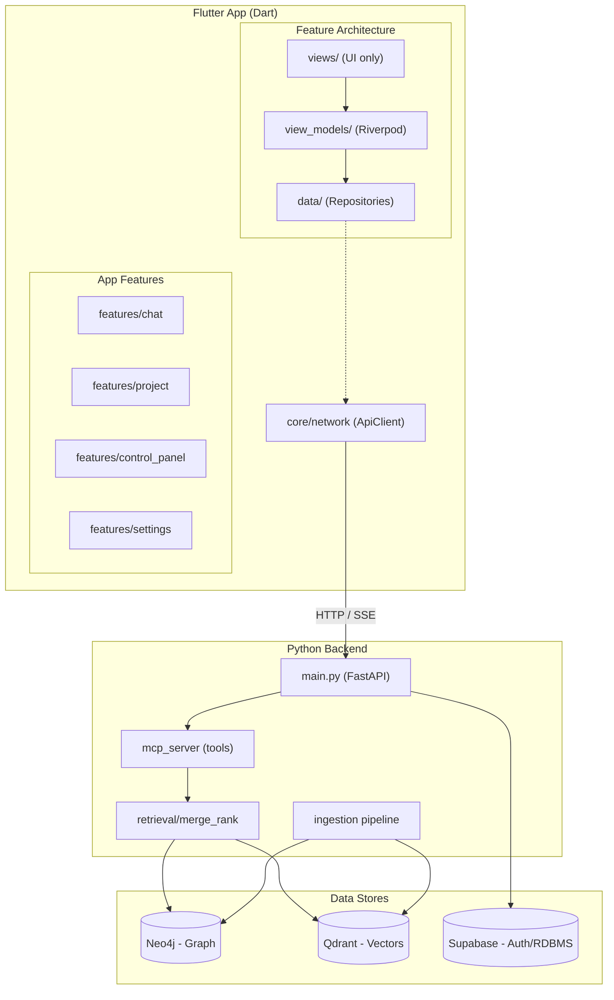

```mermaid
graph TD
    subgraph Flutter["Flutter App (Dart)"]
        subgraph CleanArch["Feature Architecture"]
            Views["views/ (UI only)"]
            ViewModels["view_models/ (Riverpod)"]
            Data["data/ (Repositories)"]
            
            Views --> ViewModels
            ViewModels --> Data
        end
        
        subgraph Features["App Features"]
            Chat["features/chat"]
            Project["features/project"]
            Control["features/control_panel"]
            Settings["features/settings"]
        end
        
        Core["core/network (ApiClient)"]
        Data -.-> Core
    end
    
    subgraph Backend["Python Backend"]
        Api["main.py (FastAPI)"]
        MCP["mcp_server (tools)"]
        Retrieval["retrieval/merge_rank"]
        Ingestion["ingestion pipeline"]
    end
    
    subgraph Storage["Data Stores"]
        Neo4j[("Neo4j - Graph")]
        Qdrant[("Qdrant - Vectors")]
        Postgres[("Supabase - Auth/RDBMS")]
    end
    
    Core -- "HTTP / SSE" --> Api
    Api --> MCP
    MCP --> Retrieval
    Retrieval --> Neo4j
    Retrieval --> Qdrant
    Ingestion --> Neo4j
    Ingestion --> Qdrant
    Api --> Postgres
```
